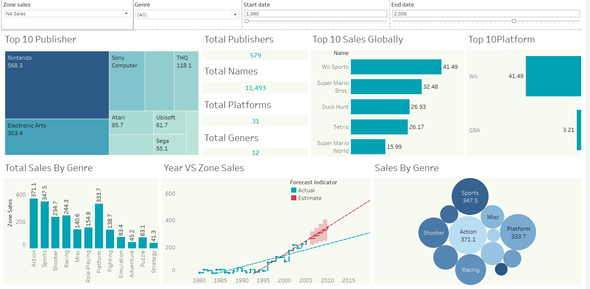

# 🎮 Global Video Game Sales Insights

## Overview
This project analyzes global video game sales data to uncover trends and patterns in the gaming industry. The dashboard provides actionable insights for stakeholders, showcasing how factors like genre, platform, and publisher influence sales performance. 

**[🌐 View Dashboard on Tableau Public](https://public.tableau.com/app/profile/dharmik.shah2873/viz/GlobalVideoGameSalesInsights/Dashboard1#2)**

---

## Key Features
- **Interactive Filters**: Analyze sales by region, genre, and time range.
- **Top 10 Analysis**:
  - Games: Global sales leaders like "Wii Sports" and "Super Mario Bros."
  - Platforms: Dominant platforms, including Wii and GBA.
  - Publishers: Leaders such as Nintendo, Sony, and EA.
- **Dynamic Visuals**:
  - Sales trends over time.
  - Regional sales distribution.
  - Genre and platform impact.

---

## Repository Contents
- 📂 **Dataset**: [Video Game Sales Data](Sales_dataset/vgsales.csv)
- 📂 **Presentation**: [Key Insights and Recommendations](Presentation/Presentation.pdf)
- 📂 **Screenshots**: Visuals from the Tableau dashboard.

---

## Insights from the Dashboard
- 🎮 **Dominant Genres and Platforms**: Action and Sports lead globally, with Wii and GBA as top platforms.
- 🌍 **Regional Trends**: North America and Europe dominate sales, with distinct genre preferences across regions.
- 📈 **Key Publishers**: Nintendo leads with iconic titles, while Sony and EA also play significant roles.
- 🚀 **Emerging Opportunities**: New platforms and genres provide untapped market potential.

---

## Tools Used
- **Tableau Public**: Dashboard creation and visualization.
- **Python**: Data cleaning and preprocessing.
- **Tableau**: Exploratory data analysis.

---

## How to Use
1. **View the Dashboard**:
   - Access the interactive dashboard directly on [Tableau Public](https://public.tableau.com/app/profile/dharmik.shah2873/viz/GlobalVideoGameSalesInsights/Dashboard1#2).

2. **Explore Locally**:
   - Clone this repository.
   - Use the provided dataset (`vgsales.csv`) for further analysis.

---

## Visual Preview
### 📊 Dashboard Overview

---

## License
This project is licensed under [MIT License](LICENSE).

---

### Connect
For any questions or suggestions, feel free to reach out!
- **Author**: Dharmik Shah
- **GitHub**: [dharmik2101](https://github.com/dharmik2101)
- **Tableau Public**: [Dharmik Shah]([https://public.tableau.com/app/profile/dharmik.shah2873](https://public.tableau.com/app/profile/dharmik.shah2873/viz/GlobalVideoGameSalesInsights/Dashboard1#2))

